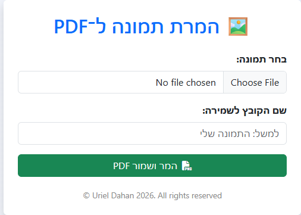

# 🖼️ Image to PDF

This project is a **client-side web application** that allows you to:

- Upload an image (`.jpg`, `.png`, `.webp`, `.gif`, `.bmp`, `.tiff`)
- Preview the image before conversion
- Enter a custom file name
- Convert the image into a **PDF formatted as A4**
- Automatically reset the interface after saving
- Display copyright ©

---

## 📂 Project Structure
│── index.html # Main application file
│── image.png # Screenshot of the UI

---

## 🚀 Usage

1. Enter [Site Link](https://harmonious-mochi-d102df.netlify.app/) in your browser (no server required).
2. Upload an image from your computer.
3. Enter a file name (optional).
4. Click **Convert and Save PDF**.
5. Download the generated PDF file.

---

## 🛡️ Security Notes

- The app only accepts valid image types (`jpeg, png, webp, gif, bmp, tiff`).
- MIME type is verified before conversion.
- All processing is done **locally in the browser** — your files never leave your computer.

---

## 📸 Preview

Here’s how the app looks:

---

---

## 🚀 Usage

1. Open `index.html` in your browser (no server required).
2. Upload an image from your computer.
3. Enter a file name (optional).
4. Click **Convert and Save PDF**.
5. Download the generated PDF file.

---

## 🛡️ Security Notes

- The app only accepts valid image types (`jpeg, png, webp, gif, bmp, tiff`).
- MIME type is verified before conversion.
- All processing is done **locally in the browser** — your files never leave your computer.

---

## 📸 Preview

Here’s how the app looks:

---

## 📦 Deployment

You can deploy the app easily with [Netlify Drop](https://app.netlify.com/drop):

1. Drag & drop the project folder (`/image-to-pdf-app`) into Netlify Drop.
2. Get a live URL instantly.

---

## ⚖️ Comparison with Existing Apps

| Feature / App            | Built-in iPhone (Files/Notes) | Adobe Scan | Microsoft Lens | CamScanner | Genius Scan | **This Website** |
|--------------------------|-------------------------------|------------|----------------|------------|-------------|------------------|
| 📥 Installation needed   | ❌ Built-in                   | ✅ Yes     | ✅ Yes         | ✅ Yes     | ✅ Yes      | ❌ No install |
| 💰 Cost / Ads            | Free, no ads                  | Free + Account | Free | Free (ads, premium version) | Paid version for full features | Free, no ads |
| 🛡️ Privacy               | Local on device               | Uploads to Adobe cloud | Can upload to OneDrive | Uploads to cloud, privacy concerns | Local but app-based | 100% Local in browser |
| 🌐 Cross-platform        | iPhone only                   | iOS, Android | iOS, Android  | iOS, Android | iOS, Android | iOS, Android, Windows, Mac, Linux |
| 🚀 Ease of use           | Medium (trick via Print)      | Medium (needs account) | Easy | Easy but f

## 👤 Author

Created by **Uriel Dahan** © 2026.  
All rights reserved.